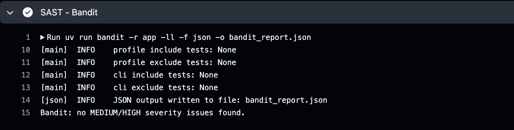
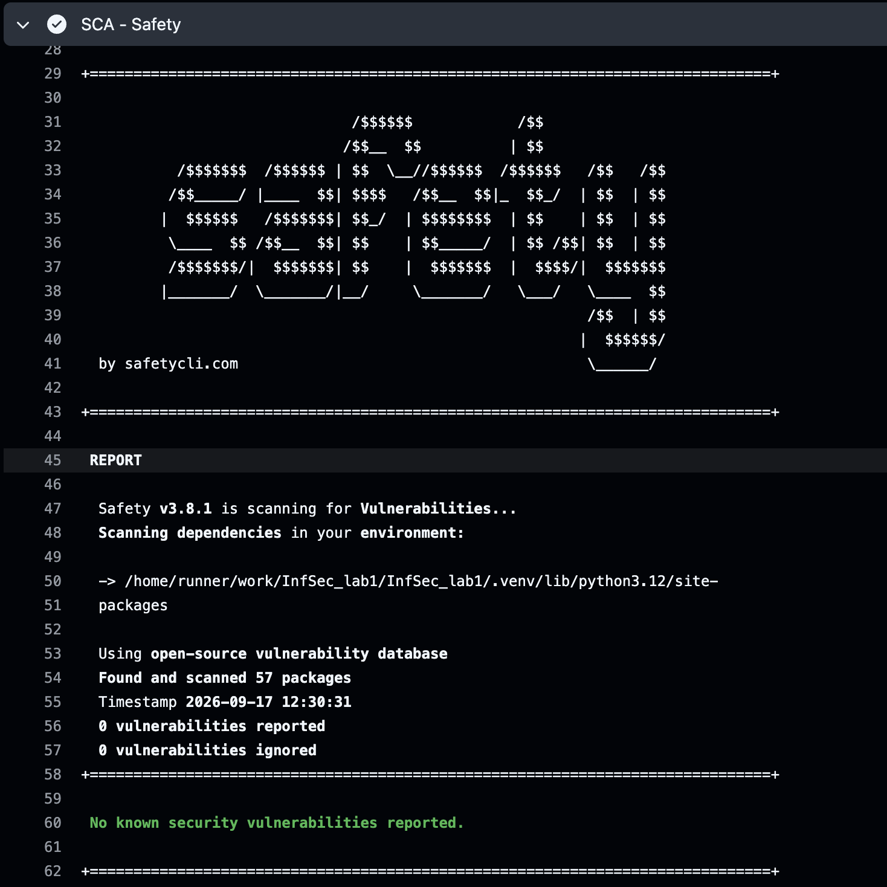

# IS_lab1 — защищённый REST API (Flask)

Защищённый от OWASP Top 10 REST API на **Python/Flask** с автоматизированной проверкой кода на уязвимости в **CI/CD**.

Стек: **Python 3.12 · Flask · Flask-SQLAlchemy (SQLite) · PyJWT · bcrypt · uv · GitHub Actions**.

---

## 1. Возможности API

| Метод | Путь              | Доступ          | Описание |
|-------|-------------------|-----------------|----------|
| POST  | `/auth/login`     | открытый        | Аутентификация по логину и паролю, выдаёт JWT |
| GET   | `/api/data`       | только по JWT   | Список пользователей |
| GET   | `/api/profile`    | только по JWT   | Профиль текущего аутентифицированного пользователя |

> Третий эндпоинт выбран самостоятельно — `/api/profile` возвращает профиль
> пользователя по содержимому JWT и дополнительно демонстрирует экранирование
> пользовательского текста (`bio`) от XSS.

Демо-пользователи (создаются автоматически при первом старте):

| Логин  | Пароль             |
|--------|--------------------|
| `alice`| `P@ssw0rd!alice`   |
| `bob`  | `P@ssw0rd!bob`     |

---

## 2. Запуск

```bash
# Установка зависимостей (uv создаст .venv)
uv sync

# Запуск сервера (по умолчанию http://127.0.0.1:8080)
uv run python run.py
```

---

## 3. Примеры запросов (curl)

```bash
# 1. Аутентификация → получаем JWT
TOKEN=$(curl -s -X POST http://127.0.0.1:8080/auth/login \
  -H "Content-Type: application/json" \
  -d '{"username":"alice","password":"P@ssw0rd!alice"}' \
  | python3 -c "import sys,json;print(json.load(sys.stdin)['token'])")

# 2. Доступ к защищённому эндпоинту с токеном
curl http://127.0.0.1:8080/api/data -H "Authorization: Bearer $TOKEN"

# 3. Профиль текущего пользователя
curl http://127.0.0.1:8080/api/profile -H "Authorization: Bearer $TOKEN"

# 4. Доступ БЕЗ токена → 401
curl -i http://127.0.0.1:8080/api/data
```

### Проверка защитных механизмов

| Сценарий | Ожидаемый результат |
|----------|---------------------|
| Неверный пароль | `401 Invalid credentials` |
| Неизвестный пользователь | `401 Invalid credentials` (тот же ответ — защита от перечисления) |
| Доступ без токена | `401 Missing or malformed Authorization header` |
| Невалидный/подделанный токен | `401 Invalid token` |
| SQL-инъекция в логине (`' OR '1'='1' --`) | `401` — параметризованный запрос, внедрение не работает |
| Пользовательский текст с HTML (`<script>…`) | Возвращается экранированным (`&lt;script&gt;…`) — защита от XSS |

---

## 4. Реализованные меры защиты (OWASP Top 10)

1. **SQL-инъекции (A03)** — все запросы к БД идут через SQLAlchemy ORM
   (параметризованные запросы), конкатенация строк для SQL отсутствует
   (`app/routes.py`, `app/security.py`).
2. **XSS (A03)** — пользовательские поля экранируются перед возвратом в ответах API
   через `html.escape` (`security.xss_escape`), см. `app/security.py`.
3. **Broken Authentication (A07)**:
   - пароли хранятся только в виде **bcrypt-хэшей** (`security.hash_password`);
   - успешный вход выдаёт **JWT** (HS256, TTL 1 час);
   - защищённые маршруты обёрнуты декоратором `@token_required`
     (`security.token_required`), который проверяет токен в заголовке `Authorization`;
   - унифицированный ответ при неверном логине/пароле — защита от перечисления пользователей.

---

## 5. CI/CD — GitHub Actions (`.github/workflows/ci.yml`)

Пайплайн запускается при каждом `push` и `pull request`:

1. **Setup** — установка `uv` и Python 3.12.
3. **SAST** (статический анализ кода) — **Bandit**:
   `bandit -r app -ll` — сборка падает только при находках **MEDIUM/HIGH**.
   Отчёт сохраняется как artifact (`bandit_report.json`).
4. **SCA** (анализ зависимостей) — **Safety**:
   `safety check --short-report` — проверка зависимостей по open-source базе
   известных уязвимостей; ненулевой код возврата при обнаружении уязвимостей.

---

## 6. Результаты сканеров

Запуск вручную (как в CI):

```bash
# SAST
uv run bandit -r app -ll -f json -o bandit_report.json

# SCA
uv run safety check --short-report
```

**Bandit:** 0 находок MEDIUM/HIGH. Есть только **3 Low-предупреждения** `B105`
(hardcoded password) — все являются ложными dev-значениями:
- `"Bearer"` — строковый литерал типа токена, не пароль;
- `"JWT_SECRET_KEY"` — имя переменной окружения;
- дефолтный dev-секрет JWT в `security.py` (в проде задаётся через env).


**Safety:** **0** известных уязвимостей в зависимостях.


